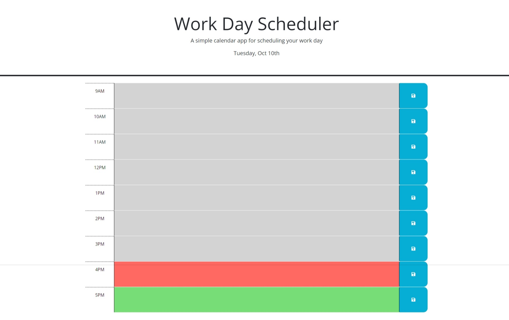

# Work Day Scheduler

## Webpage Description
This is a calendar application that allows a user to save tasks for each hour of a typical 9am-5pm work day. The calendar is loaded dynamically through JavaScript.

The user can enter their tasks for any time slot and hit the corresponding save button to it's right. Upon hitting this save, the task is added to localstorage. If the user refreshes or returns to the browser, the application will load the saved calendar in local storage so that the user can pick up were they left off.

The calendar will also color code based on if the time was in the past (grey), present (red), or future (green). This will update whenever the user refreshes the page.

## Link to Website
The deployed website can be accessed [here](https://wald14.github.io/work-day-scheduler/)

## Acknowledgements
- Gary Almes (Professor)
- [W3School](https://www.w3schools.com/)
- [MDN Web Docs](https://developer.mozilla.org/)
- [Stack Overflow](https://stackoverflow.com)
    - [How can I get the class of a parent element](https://stackoverflow.com/questions/17109593/how-can-i-get-the-class-of-a-parent-element)
    - [How can I get the id a parent element using jquery](https://stackoverflow.com/questions/3239598/how-can-i-get-the-id-of-an-element-using-jquery)
    - [How can I add click events for dynamically appended elements using jquery](https://stackoverflow.com/questions/36106850/how-to-add-click-events-for-dynamically-appended-elements-using-jquery)
- Duckett, Jon. JavaScript &amp; JQuery: Interactive Front-End Web Development. John Wiley &amp; Sons, 2014. 
- Duckett, John. HTML &amp; CSS: Design and Build Websites. John Wiley and Sons, 2014. 

## Site Preview
The following image shares the web application's apperance:
 

